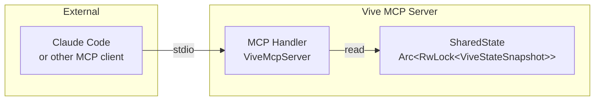

# Architecture

## Technology Stack

- **Language**: Rust
- **TUI Framework**: [Ratatui](https://github.com/ratatui-org/ratatui) (for rich, interactive terminal UI)
- **Backend Engine**: Tmux (via CLI or control mode)
- **Configuration**: TOML or YAML

## Component Design

### 1. Core (State Manager)
- Manages the in-memory state of projects and tasks.
- **Project Discovery**: Scans a configured root directory (e.g., `~/src/github`) for Git repositories.
- **Task Discovery**: Parses `git worktree list` for each project to identify active tasks.

### 2. Process Monitor (The "Pulse")
- A background worker or polling mechanism that checks the status of `claude` processes in each worktree.
- **Status Detection Logic**:
    - **Running**: PID exists, CPU active / recent stdout output.
    - **Waiting**: PID exists, process state is sleeping (S/S+), and stdout matches "input prompt" patterns (e.g., "> ", "Waiting for input").
    - **Done**: Process exited successfully.
    - **Error**: Process exited with error.

### 3. TUI Layer (The "Face")
- **Dashboard View**:
    - Sidebar: Project list with aggregate status indicators.
    - Main Area: Task details for the selected project.
- **Interaction**:
    - Keyboard navigation (vim-style j/k) and Mouse support.
    - "Open" action triggers the Tmux Orchestrator.

### 4. Tmux Orchestrator (The "Hands")
- Interacts with Tmux to create sessions, windows, and panes.
- **Cockpit Layout**: Automatically splits windows based on active tasks when a project is opened.
- **Session Management**: Ensures persistent sessions even when the TUI is closed.

## Data Flow

```mermaid
graph TD
    subgraph Core
        D[Discovery Module] -->|Projects & Worktrees| S[AppState]
        M[Monitor Module] -->|Statuses (Map)| S
    end

    subgraph TUI
        S -->|Render| V[View Layer]
        K[Input Event] -->|Handle| A[Action Handler]
    end

    subgraph Orchestration
        A -->|Create/Switch| T[Tmux Orchestrator]
        A -->|Send Keys| T
        A -->|Create Worktree| G[Git Wrapper]
    end

    V -->|Display| User
    User -->|Keyboard/Mouse| K
    T -->|Manage| Tmux[Tmux Process]
    G -->|Update| D
```

## State Management Strategy

1.  **Static Data (Projects/Worktrees)**:
    - Loaded once at startup via `Discovery Module`.
    - Reloaded explicitly when user requests "Refresh" or performs "Create Task".

2.  **Dynamic Data (Agent Statuses)**:
    - Managed by `Monitor Module` running in a background async task.
    - Updates are sent to the main UI loop via a `tokio::sync::mpsc` channel.
    - `AppState` holds a `HashMap<SessionId, AgentStatus>` which is updated on every tick.

3.  **UI Rendering**:
    - The TUI renders based on a snapshot of `AppState`.
    - It joins the Static Data (Project Tree) with Dynamic Data (Status Map) using `SessionId` as the key.

4.  **Favorites Persistence**:
    - Favorites are stored in `~/.vive/favorites.toml`.
    - Loaded at startup, saved immediately when toggled.
    - **Robustness**: If loading fails (e.g., corrupted file), a `favorites_load_failed` flag is set.
    - When this flag is set, saving is skipped to prevent overwriting potentially valid data.
    - This prevents data loss in edge cases where the file cannot be read but may still contain valid favorites.

### 5. MCP Server (Model Context Protocol)

The MCP server exposes Vive's internal state to external tools (like Claude Code) via the Model Context Protocol.

- **Transport**: Stdio (standard input/output)
- **Mode**: Standalone server mode (`vive --mcp-server`)
- **Implementation**: Uses the `rmcp` crate (official Rust MCP SDK)

#### Resources

| URI | Description |
|-----|-------------|
| `vive://projects` | All projects and worktrees discovered by Vive |
| `vive://status` | Agent statuses for all sessions (project:branch) |
| `vive://logs/{session_id}` | Pane preview content for a specific session |

#### Architecture



#### State Snapshot

The MCP server uses a `ViveStateSnapshot` struct that captures:
- **Projects**: Name, path, and worktrees for each discovered project
- **Statuses**: Agent status (Working, Idle, Waiting, etc.) for each session
- **Pane Previews**: Terminal output content for each session

#### Usage

To run Vive as an MCP server:

```bash
vive --mcp-server
```

Configure in Claude Desktop's `claude_desktop_config.json`:

```json
{
  "mcpServers": {
    "vive": {
      "command": "vive",
      "args": ["--mcp-server"]
    }
  }
}
```
