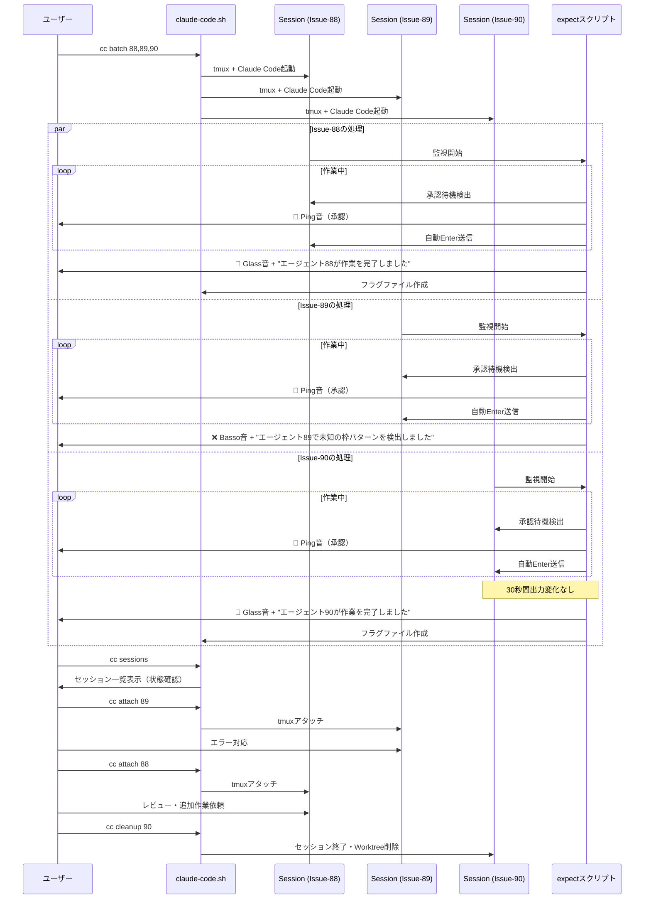
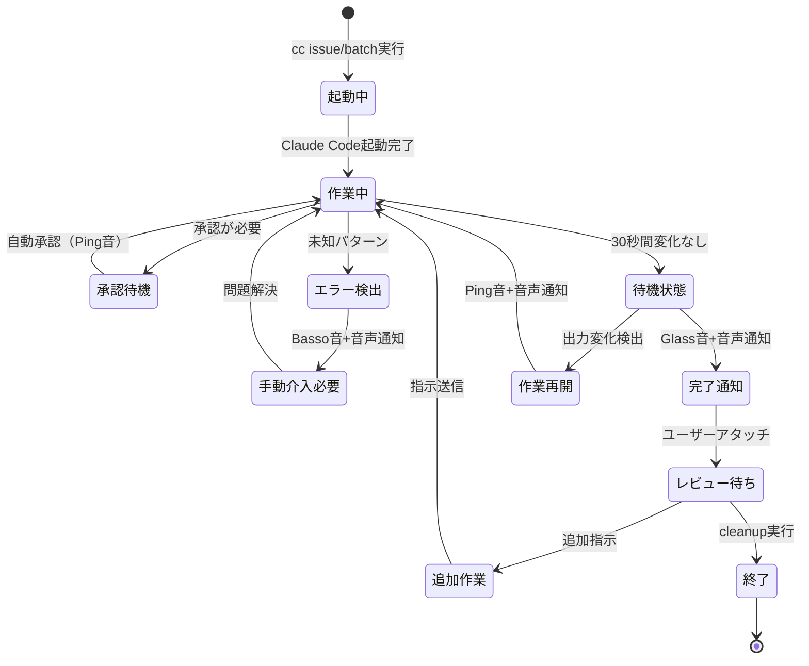

# Claude Code 並列実行ワークフロー仕様

## 概要

複数の Claude Code セッションを並列実行し、音声通知で状態を把握しながら効率的に作業を進めるワークフロー。

## ワークフロー図



## 状態遷移図



## 音声通知の役割

### 1. 🔔 Ping 音（/System/Library/Sounds/Ping.aiff）

- **意味**: 作業が進行中（自動承認が発生）
- **アクション**: 特になし（順調に進んでいることを認識）
- **頻度**: 承認のたびに鳴る

### 2. ❌ Basso 音（/System/Library/Sounds/Basso.aiff）

- **意味**: エラー発生（未知のパターン検出）
- **音声**: "エージェント [Issue 番号] で未知の枠パターンを検出しました。確認が必要です。"
- **アクション**:
  - `cc sessions` で状態確認
  - `cc logs [Issue番号]` でログ確認
  - `cc attach [Issue番号]` で対応

### 3. 🔔 Glass 音（/System/Library/Sounds/Glass.aiff）

- **意味**: 作業完了（待機状態）
- **音声**: "エージェント [Issue 番号] が作業を完了しました"
- **アクション**:
  - `cc attach [Issue番号]` でレビュー
  - 追加作業が必要なら指示
  - 完了なら `cc cleanup [Issue番号]`

### 4. 🔄 作業再開通知（Ping 音）

- **意味**: 待機状態から作業再開
- **音声**: "エージェント [Issue 番号] が作業を再開しました"
- **アクション**: 特になし（作業が再開されたことを認識）

## ユーザーの監視パターン

### パターン 1: 定期的な音の確認

```
Ping音が聞こえる → 作業進行中 ✅
↓
音が途絶える（30秒以上）
↓
cc sessions → 状態確認
↓
待機中のセッションをレビュー
```

### パターン 2: エラー音への対応

```
Basso音 + "エージェント89で..." → エラー発生 ⚠️
↓
cc logs 89 → ログ確認
↓
cc attach 89 → 手動対応
↓
問題解決後、作業再開
```

### パターン 3: 完了通知への対応

```
Glass音 + "エージェント88が..." → 作業完了 ✅
↓
cc attach 88 → レビュー
↓
追加作業 or cc cleanup 88
```

## 並列実行の利点

1. **効率的な時間活用**: 複数の Issue を同時進行
2. **受動的な監視**: 音声通知で状態を把握、必要時のみ介入
3. **コンテキストスイッチの最小化**: 完了したものから順次レビュー

## 推奨される運用

1. **バッチ実行**: 関連する複数の Issue をまとめて実行

   ```bash
   cc batch 88,89,90,91
   ```

2. **定期的な状態確認**: 音が途絶えたら

   ```bash
   cc sessions
   ```

3. **順次レビュー**: 完了通知が来たものから

   ```bash
   cc attach [完了したIssue番号]
   ```

4. **整理整頓**: レビュー完了後は速やかに
   ```bash
   cc cleanup [Issue番号]
   ```
